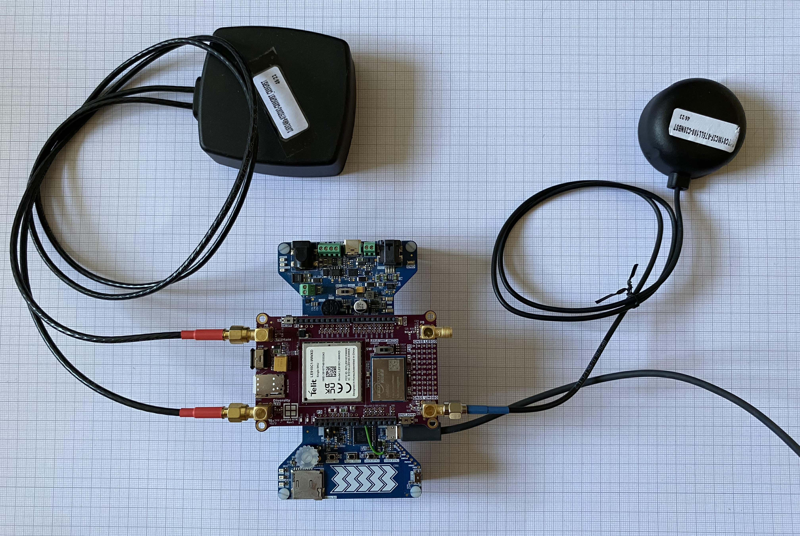
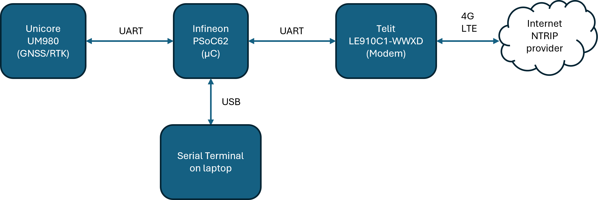
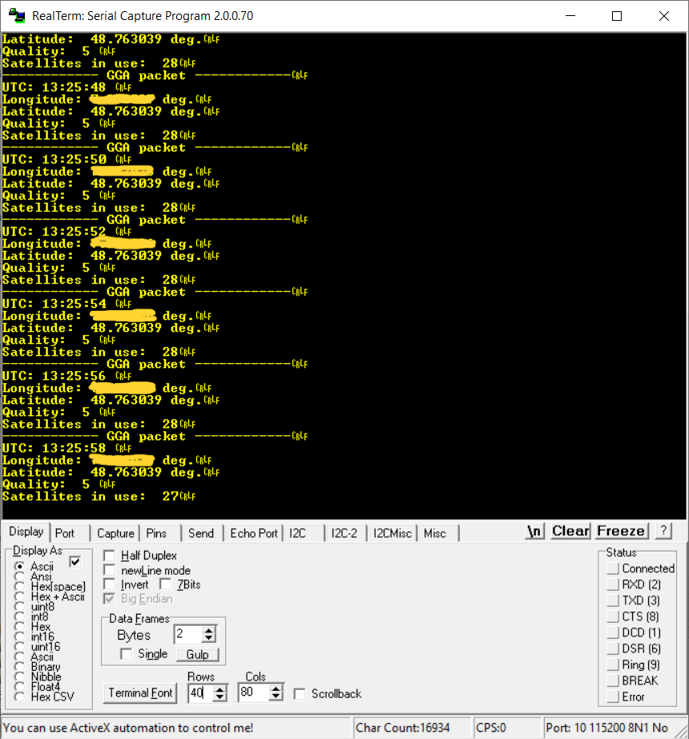
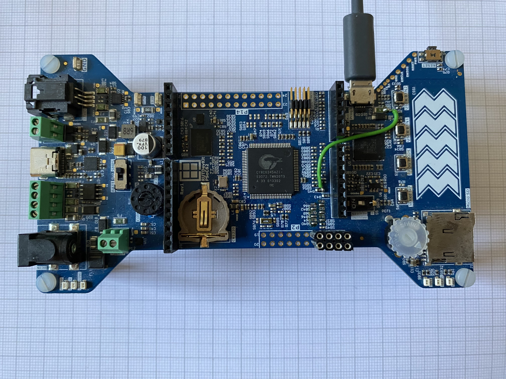
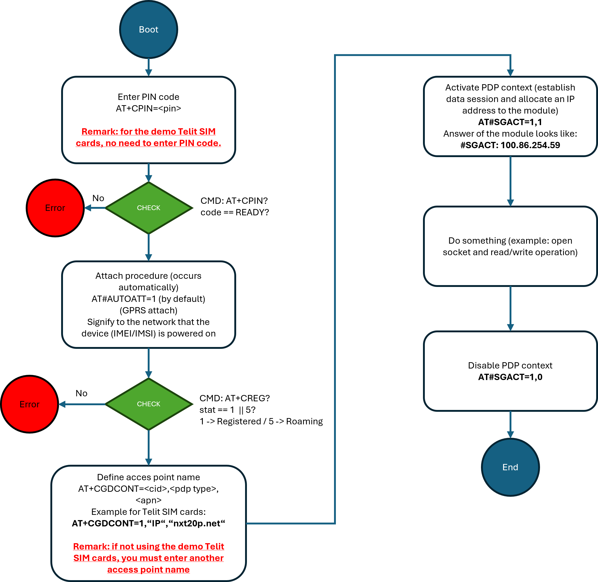

# RDK2 - Rover using RDK2 and RAB4-RTK

This example demonstrates how to use the UM980 sensor as a rover (moving unit for which we want to know the position).

To get very accurate (~2 cm precision) positioning, the UM980 needs correction data (RTCM). Those correction data are gathered from the Internet using the LE910C1 modem from Telit.

Remarks: 
- Almost 800 bytes/seconds data reception is necessary to receive the correction data.
- A "free of charge" provider is used for this example. You can of course change it for your needs.

Once started, the demonstrator output the current coordinates on a serial terminal:

On the previous screenshot, you can see that the quality is "5" which means that the module uses RTCM correction data to compute its position. Quality "5" means RTK float (i.e. a precision of about 50 cm). The best quality you can have is "4" which means RTK fix (precision of about 2 cm).

## Requirements

- [ModusToolbox® software](https://www.infineon.com/cms/en/design-support/tools/sdk/modustoolbox-software/) **v3.x** [built with **v3.1**]
- [RAB4-RTK](https://www.rutronik24.com/product/rutronik/rab4rtk/21856667.html)
- [RDK2](https://www.rutronik24.fr/produit/rutronik/rdk2/16440182.html)
- [GNSS antenna (at least L1/L2 or L1/L5)](https://www.2j-antennas.com/antennas/single-external-antennas/2j7c01mc2f-high-precision-gps-glonass-sbas-rtk-l1-l2-dome-magnetic-mount-antenna/381)
- [4G LTE antenna](https://www.2j-antennas.com/antennas/combination-external-antennas/2j6924ma-phoenix-cellular-4g-lte-3g-2g-mimo-ip67-ip69-magnetic-mount-antenna/486)
- A valid SIM card. A SIM card from Telit is provided with the RAB4-RTK (data consumption limited to 100MB).

## Needed hardware modifications

When powering the RDK2 from the KitProg3 USB interface, the current consumption is limited to 0.4A (using the TCK22946G load switch from Toshiba). That is not enough to power the Telit LE910C1 modem and the Unicore UM980 GNSS sensor. To make the demonstrator work, you will need to short the load switch as done in the picture below (green cable):

## Software modifications

If you are not using a Telit SIM card, you will need to change the access point name in the file "rab_rtk.c". This is done in the method **rab_rtk_telit_define_pdp_context".

    char cmd[] = "AT+CGDCONT=1,\"IP\",\"nxt20p.net\"\r\n";

Replace **nxt20p.net** with the correct access point name.

To change the NTRIP provider (and mount point) you will need to change the configuration in the file "main.c":

    ntrip_receiver_open_async("caster.centipede.fr", 2101, "GUIGO");

## Telit LE910C1 initialization

## Using the code example with a ModusToolbox™ IDE:

The example can be directly imported inside Modus Toolbox by doing:
1) File -> New -> Modus Toolbox Application
2) PSoC 6 BSPs -> RDK2
3) Sensing -> RDK2 RAB4 RTK LE910C1 Rover

A new project will be created inside your workspace.

To program the software on the PSoC62, use the KitProg3 USB connector. Build the application (using the link in Modus Toolbox) and click on **RDK2_RAB4_RTK_LE910C1_Rover Program (KitProg3_MiniProg4)**.

## Operation

Simply plug a USB-cable into the KitProg3 USB connector of the RDK2 and connect it to your computer. The LEDs will start to flash. Meaning of the LEDs:

LED1 | LED2 | System status 
--- | --- | ---
OFF | OFF | Error state. Something wrong happened. Use the KitProg3 USB connector and a serial terminal to read the error messages.
--- | --- | ---
x | Blinking | Software is running
Blinking | x | RTCM correction data are being received by the Telit LE910C1 modem.

## Legal Disclaimer

The evaluation board including the software is for testing purposes only and, because it has limited functions and limited resilience, is not suitable for permanent use under real conditions. If the evaluation board is nevertheless used under real conditions, this is done at one’s responsibility; any liability of Rutronik is insofar excluded. 

